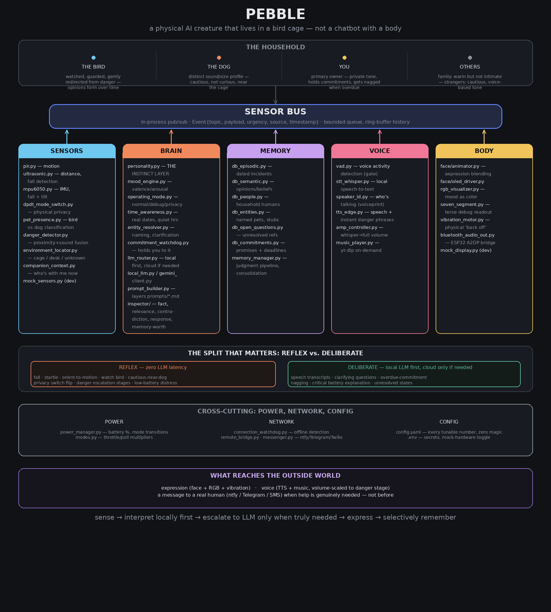

# 🐾 Pebble

**A physical AI creature that lives in a bird cage — not a chatbot with a body.**

Pebble is a personal desk companion, bird friend, and dog friend with a physical body. It senses the world through real sensors, reacts instantly through hard-coded instincts, only reaches for a language model when something genuinely needs words or reasoning, expresses itself through a face/LEDs/voice, and remembers — selectively — the way a real animal would.

This repository is documented across three files. Start here, then go deeper:

| File | What's in it |
|---|---|
| **README.md** (this file) | Orientation, architecture diagram, quick start, project status |
| **[KNOWLEDGE.md](./KNOWLEDGE.md)** | Deep technical reference — every module, every config key, every database schema, the cognitive model explained in full |
| **[CAPABILITIES.md](./CAPABILITIES.md)** | The exhaustive list — every scenario Pebble is designed to handle, 35 future feature ideas, the speaker-separation library research, and a full audit of every placeholder/stub that still needs real code before this runs on real hardware |

---

## Architecture at a glance



Everything in this diagram is a real module in the codebase (`companion/`), organized into five lanes — Sensors, Brain, Memory, Voice, Body — all talking to each other exclusively through the **Sensor Bus**, an in-process publish/subscribe event system. No module calls another module's internals directly. This is what lets you swap real hardware for mock hardware, or a cloud LLM for a local one, without touching anything downstream.

The single most important line in that diagram is the **Reflex vs. Deliberate split**. Most of what Pebble does — flinching at a fall, watching the bird, being wary near the dog, reacting to a privacy switch — happens in well under 50 milliseconds with zero language model involved, because it's just a rule firing. Only genuinely ambiguous or language-shaped situations (someone talking to it, a confusing new name, an overdue promise worth mentioning) ever reach an LLM, and even then, a small local model is tried before any cloud call.

---

## Project status (honest, as of this writing)

Pebble is under active development. Read this section before assuming anything below is fully live:

- ✅ **Solid and tested:** the event bus (`sensors/sensor_bus.py`), the instinct/reflex layer (`brain/personality.py`), the mood engine (`brain/mood_engine.py`), operating mode switching (`brain/operating_mode.py`), the memory judgment pipeline (`memory/memory_manager.py`), entity resolution and clarification-asking (`brain/entity_resolver.py`), and the commitment-tracking system (`brain/commitment_watchdog.py`).
- 🟡 **Wired but stubbed:** most direct hardware I/O — real GPIO/I2C sensor reads, real display rendering, real audio playback, real Bluetooth. These have clearly marked `# SENSOR INPUT HOOK` comments showing exactly where real code needs to go. See [CAPABILITIES.md's placeholder audit](./CAPABILITIES.md#placeholder-and-stub-audit) for the complete, file-by-file list.
- 🔲 **Designed, not yet built:** several of the more ambitious scenarios in CAPABILITIES.md (camera-based vision, live Google Contacts sync, ESP32 Bluetooth audio bridge) are architecturally planned but don't have code yet.

Nothing in this project pretends to be more finished than it is. If a capability is described somewhere in these docs, it's tagged as one of: **LIVE**, **STUB (hook exists, needs real implementation)**, or **DESIGNED (not yet started)**.

---

## What Pebble actually is, physically

- Lives in a bird cage. Has an internal model of *where it is* (`sensors/environment_locator.py`) and shifts its priorities depending on whether it's in the cage, on a desk, or somewhere unrecognized.
- Distinguishes the bird from the dog from a human using motion, distance, and voice signals fused together (`sensors/pet_presence.py`, `sensors/companion_context.py`) — imperfectly today with cheap sensors, much more reliably once a camera is added.
- Has a face (OLED), an RGB mood indicator, a seven-segment debug readout, a vibration motor for physical "back off" warnings, and a speaker with volume that scales from a whisper to full alarm depending on how urgent the situation is.
- Runs on a battery, knows its own charge level, and gets audibly, visibly more distressed the longer a critical-battery state goes unaddressed — the same escalation logic used when the bird is in physical danger.
- Can genuinely message a real person (you, or someone else in the household) when something needs attention that it can't resolve on its own — via free push notifications (ntfy.sh), Telegram, or paid SMS (Twilio), never silently.

## What Pebble actually knows and remembers

- Real dates and times (`brain/time_awareness.py`) — not just "an event happened," but *when*, in a way it can talk about naturally ("that was about three days ago," not a raw timestamp).
- The difference between something worth forgetting in a month and something worth keeping forever — a routine sensor blip decays fast; a fall, a real danger to the bird, or the day you brought a new pet home is retained permanently (`brain/inspector/memory_worth_inspector.py`).
- Who it's talking to, by voice — a different, more private tone for its primary owner, a warmer-but-less-familiar tone for other family, and a cautious tone for an unrecognized stranger.
- Named things. If you say "I got a bird" today and "her name is Ken" three days later, Pebble correctly merges those into one timeline — it knows it had you two days before it knew your name, the way a real memory works, not a database overwrite (`brain/entity_resolver.py`, `memory/db_entities.py`).
- Promises. If you say you'll do something and don't, Pebble notices, waits a reasonable grace period, and brings it up later in its own voice — not as a nagging notification, but the way a housemate who noticed would (`brain/commitment_watchdog.py`).

## What Pebble is not

- Not a general-purpose voice assistant. It won't set timers, read the news, or answer trivia the way an Alexa/Google Home would, unless you specifically build that in.
- Not always listening to the cloud. Local rules and a local LLM handle almost everything; a cloud model is only used as a last resort, and never at all while the physical privacy switch is engaged.
- Not infallible at telling the bird from the dog from a human yet. Today's sensors are cheap proximity/motion heuristics, not vision. It's honest about low-confidence guesses rather than pretending certainty it doesn't have.

---

## Quick start

```bash
cd companion
python -m venv venv
source venv/bin/activate        # Windows: venv\Scripts\activate
pip install -r requirements.txt
cp .env.example .env             # fill in whatever you have — everything has a safe default
python main.py
```

With `COMPANION_MOCK_HARDWARE=true` in `.env` (the default), Pebble boots entirely on synthetic sensor data — no hardware required to see the whole event pipeline running end to end. Watch `logs/companion.log` or stdout for the event trail.

Run the test suite to confirm the core logic independent of any hardware:

```bash
pip install pytest
python -m pytest tests/ -v
```

For everything else — every module explained, every config key documented, every database schema laid out — go to **[KNOWLEDGE.md](./KNOWLEDGE.md)**.

For the full list of what Pebble can do, every scenario it's designed to handle, the future roadmap, and a precise list of what still needs real code before any of this touches real hardware — go to **[CAPABILITIES.md](./CAPABILITIES.md)**.

---

## Design philosophy, in one sentence

**Sense → interpret locally first → escalate to a language model only when language or reasoning is truly needed → express through face/LEDs/voice → selectively remember.**

Everything else in this project is that sentence, implemented.

---

## License

MIT — free for personal use, modification, and distribution.

## A note on tone

Pebble's personality lives in `prompts/*.md`, not in code. If you want a calmer creature, a bossier one, one obsessed with a different pet, or one with an entirely different relationship to its housemates — you don't need to touch a single Python file. Edit the prompts. The architecture is deliberately built so personality is data, not logic.